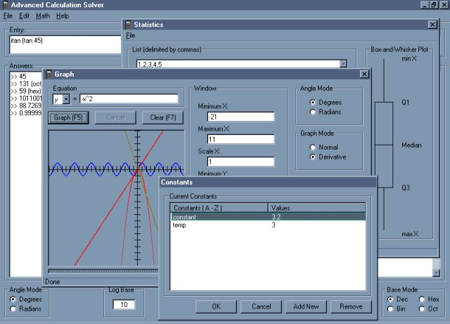



## Advanced Calculation Solver 1\.2

### Description

The basic function of this program takes an inputted mathematical string (e.g.: "ln e + rnd(2) + 3(2)4 * (log(tan (itan 1)))"), evaluates it, and returns the result. Its features are listed below:<ul type=disc><li>Mathematical string evaluation using a compiler theory</li><li>Flexible language</li><li>Radian and degree modes</li><li>Decimal, binary, hexadecimal, and octal modes</li><li>Editable logarithm bases</li><li>Editable number of decimal places</li><li>Fully customizable appearance and behavior</li></ul>The program also has support for several special math items that are listed below:<ul type=disc><li>User-defined constants</li><li>Graphing of equations (both x = ? and y = ?)</li><li>Graphing in radian or degree mode</li><li>Graphing in normal or derivative mode</li><li>User-defined graphing window size (minimum X/Y, maximum X/Y, scale X/Y)</li><li>Statistical analysis from a list</li><li>Box-and-whisker plots</li></ul>Full documentation is included with Advanced Calculation Solver, which includes feature descriptions, how to use the program, syntax descriptions, and detailed explanations of the workings of the code.
Bug fixes:<ul type=disc><li>Derivative bug that, when in radian mode, gave an incorrect graph display</li><li>Parsing bug that parsed from right to left instead of left to right</li></ul>Anton Venema avenema@nc.rr.com
Please remember to vote!

 
### More Info
 

             |
---                |---
**Submitted On**   |2000-11-26 20:23:42
**By**             |[Anton Venema](https://github.com/Planet-Source-Code/PSCIndex/blob/master/ByAuthor/anton-venema.md)
**Level**          |Advanced
**User Rating**    |4.9 (132 globes from 27 users)
**Compatibility**  |VB 5\.0, VB 6\.0
**Category**       |[Complete Applications](https://github.com/Planet-Source-Code/PSCIndex/blob/master/ByCategory/complete-applications__1-27.md)
**World**          |[Visual Basic](https://github.com/Planet-Source-Code/PSCIndex/blob/master/ByWorld/visual-basic.md)
**Archive File**   |[CODE\_UPLOAD1209611262000\.zip](https://github.com/Planet-Source-Code/anton-venema-advanced-calculation-solver-1-2__1-13032/archive/master.zip)

